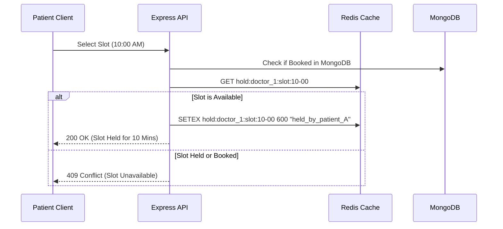

# System Design Write-up: Core Mechanics

This document details the system design considerations for key scheduling, locking, and integration components of the WellNest Healthcare platform.

---

## 1. Double-Booking Prevention

### Current Implementation
The backend prevents concurrent booking of the same slot using a standard pre-save query in the [AppointmentController](file:///E:/Class%20Notes/important%20projects/daffodil%20software/healthcare-appointment/backend/src/controller/AppointmentController.ts#L179-L187):
```typescript
const existing = await Appointment.findOne({ doctorId, scheduledTime, status: { $in: ["booked", "rescheduled"] } }).exec();
if (existing) throw new ConflictError("This slot is already booked");
```

### Production Enhancements
While sufficient for low-traffic applications, this query-then-insert pattern is prone to **race conditions** under concurrent requests (the "Time-of-Check to Time-of-Use" or TOCTOU bug). If two users check the availability of the same slot at the exact same millisecond, both will pass the read check and both will write to the database.

To eliminate double-bookings in production:
1. **Unique Database Indexes**: Define a compound unique index on MongoDB's `appointment` schema:
   ```javascript
   appointmentSchema.index({ doctorId: 1, scheduledTime: 1, status: 1 }, { unique: true });
   ```
   If a duplicate write occurs, MongoDB immediately throws a write conflict error (`E11000`), which the controller catches and handles gracefully.
2. **Distributed Locks (Redlock)**: For high-volume distributed environments, acquire a lease-based distributed lock on Redis (keyed on `lock:doctor:${doctorId}:slot:${scheduledTime.toISOString()}`) prior to booking. The lock is held for the duration of the booking transaction and released immediately after.

---

## 2. Doctor Leave Conflict Handling

### Current Implementation
Before creating an appointment, the controller checks whether the scheduled date coincides with any entry in the doctor's `leaveDays` array:
```typescript
const isOnLeave = (doctor.leaveDays || []).some(leaveDate => new Date(leaveDate).toDateString() === dateString);
```
If a match is found, the system rejects the booking request.

### Production Enhancements
A critical challenge occurs when a doctor schedules leave **retroactively** (declaring leave for a date where appointments have already been booked).
1. **Cascade Cancellations/Rescheduling**: When a doctor requests leave via `DoctorController.updateLeaveDays`, the backend initiates a transaction that:
   - Queries all active appointments (`booked` or `rescheduled`) for that doctor on those leave dates.
   - Updates their status to `cancelled` or marks them as `pending-reschedule`.
   - Dispatches automated notification jobs to affected patients.
2. **Interactive Overlap Warning**: When saving leave days, the UI prompts the doctor: *"You have 3 active appointments on this day. Proceeding will automatically cancel them. Would you like to reschedule instead?"*

---

## 3. Slot Hold Mechanism

### Design Strategy
To ensure a smooth checkout/symptom questionnaire flow and prevent "cart sniping" (where a slot is taken by another user midway through form submission), a **temporary slot hold mechanism** is required.



1. **Redis TTL Storage**: When a user selects an available time slot, the API reserves the slot by executing:
   `SETEX hold:doctor:${doctorId}:slot:${slotTime} 600 ${patientId}`
   This reserves the slot for 10 minutes (600 seconds).
2. **Modified Availability Checks**: The endpoint that returns available slots scans both booked MongoDB appointments and active Redis holds. If a hold key exists and does not belong to the current session, the slot is filtered out.
3. **Transaction Completion/Release**: Upon successful checkout, the hold key is deleted (`DEL`) and the appointment is written permanently to MongoDB. If the 10-minute timer expires, Redis automatically purges the key, releasing the slot.

---

## 4. Notification Failure Handling

### Current Implementation
Email and Google Calendar dispatches are executed inside standard `try/catch` blocks within [EmailService](file:///E:/Class%20Notes/important projects/daffodil%20software/healthcare-appointment/backend/src/service/EmailService.ts#L19-L22):
```typescript
try {
    await transporter.sendMail(...);
} catch (error) {
    console.error("Email failed:", error.message);
    // Silent fail so API doesn't crash
}
```

### Production Enhancements
Executing network-bound operations synchronously during the API request lifecycle is anti-pattern: it slows down API responses and results in permanently lost notifications if the mail server or Google OAuth API times out.

1. **Outbox Pattern with Message Queues (BullMQ / Redis)**: Offload all notifications to a background queue. The API writes a message job to BullMQ:
   ```typescript
   await emailQueue.add('sendConfirmation', { emailData });
   ```
2. **Automatic Retries with Exponential Backoff**: Background workers process the queue asynchronously. If a notification fails (e.g., SMTP rate limiting), the worker retries the job up to 5 times using exponential backoff (e.g., waiting 10s, 30s, 2m, etc.).
3. **Dead Letter Queue (DLQ)**: If a job fails after maximum retries, it is moved to a DLQ for administrator auditing and manual retry.
